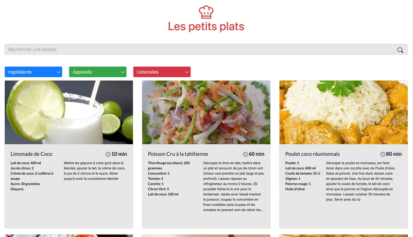
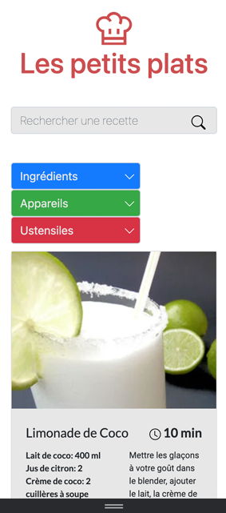

# Project 7 "Les petits plats" from React JS Application Developer Training: 
Develop a search algorithm in JavaScript.

 
##
**Skills developed:**
- Analyze a computer problem
- Develop an algorithm to solve a problem
##
**Start the project:** 
Nothing to install here, just open the index.html file. 
 
**Using the directory:** 
This project contains 2 branches to test two different versions of the "search bar" functionality.
- "cla" branch: 
:point_right: [here](https://github.com/cla31/Les-petits-plats-P7-Cla31/tree/cla)
- "secondAlgo" branch: 
:point_right: [here](https://github.com/cla31/Les-petits-plats-P7-Cla31/tree/secondAlgo)
 
The objective is to be able to compare their performance and then choose the best one.
##
**Project problem**:  
Filter recipes according to the needs of a user.  
The user must be able to enter a recipe in the search field and quickly access it in the interface. 
##
To view the page online click  :point_right: [here](https://cla31.github.io/Les-petits-plats-P7-Cla31/#)
##
Application overview  (in desktop version):
 
 

 
 
Application overview (in mobile version):
 
 

